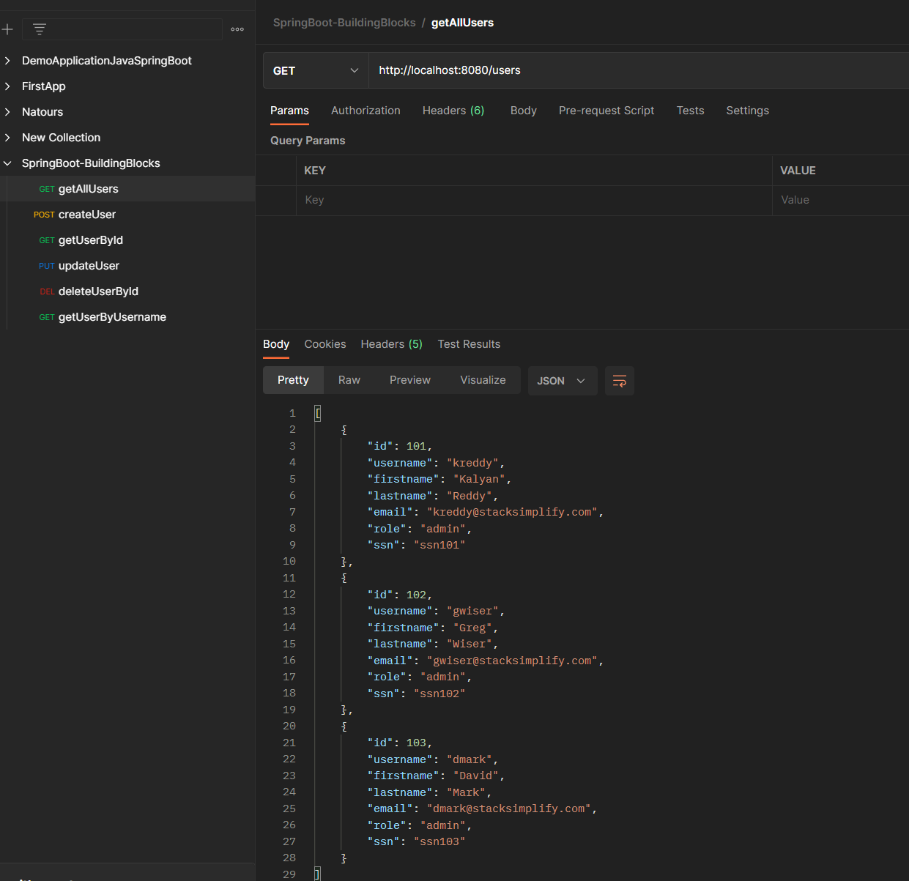
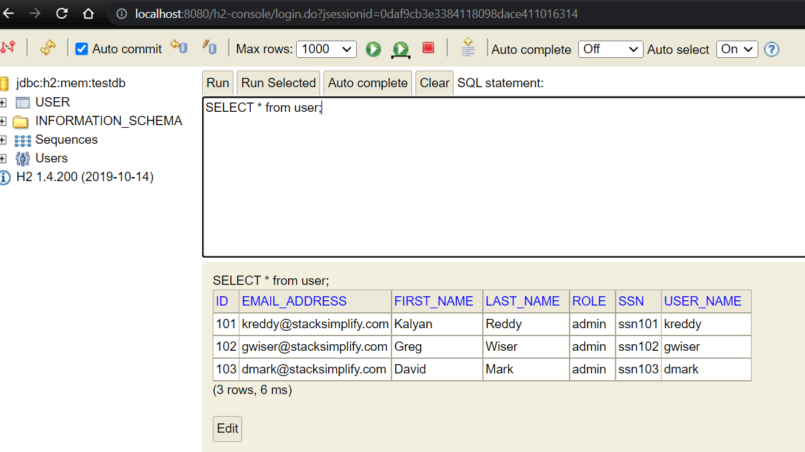

# Addition comment: A User Management Service
- Using Java Spring Boot to develop RESTful APIs Webservices using Spring Data JPA, database H2, and test on Postman IDE
- Design URL to manage the user data connection to the database with http methods: GET, POST, PUT, and DELETE
- Exception handling with ResponseStatusException

# link h2 database:
http://localhost:8080:/h2-console

# HTTP Method:
getAllUser
- GET http://localhost:8080/users
getUserById:
- GET http://localhost:8080/users/101 
getAllOrders
- http://localhost:8080/users/102/orders

# CLI: git new branch
- git show-branch
- git checkout -b "04-ExceptionHandling-ResponseStatusCodes"
- git push --set-upstream origin 04-ExceptionHandling-ResponseStatusCodes
- git branch -a

# CLI: git merge
- git checkout main
- git merge 04-ExceptionHandling-ResponseStatusCodes
- git push